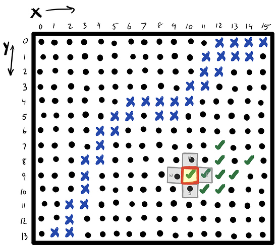
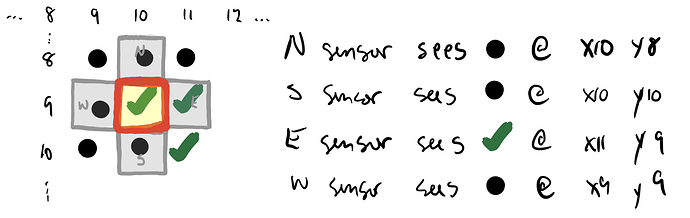
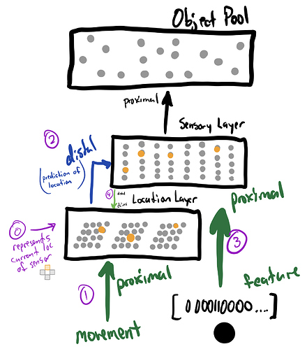
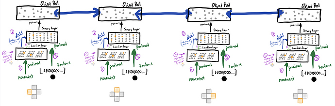

# HTM 2D Object Modeling

> See the origin of this project on [this HTM Forum thread](https://discourse.numenta.org/t/2d-object-recognition-project/5465/12?u=rhyolight).

The purpose of this project is to define **2D Object Recognition Tests**.

## Current project status
- TODO

## Task definition
### Object Schema

Objects exist within a 2D space. The space has a width and height. Each location in the space can be identified with an X and Y integer coordinate. Each location may have a Feature.

Objects can be defined as collections of Features in 2D space. Here is an example object schema containing one feature `X` at 14,5

```yaml
---
name: Some Object
width: 20
height: 20
features:
  - { x: 14, y: 5, data: X }
```

### Features

Features always contain data. A Feature's data is used by the Agent to identify objects.

Initially, all Features consist of a simple data type, but should be extensible to contain any data type. For example, current the current Object Library consists of simple one-character features.

### Object Library

The Object Library can be found in `objects/`. Each YAML file within this directory contains one object definition in the format specified in "Object Schema" above.



## Agency

An Agent can exist in a location within an Object space. An Agent observing an object will receive features in space according to the location of its sensors.



Each Agent has exactly 4 sensors:
- North (Agent Y - 1)
- South (Agent Y + 1)
- East  (Agent X + 1)
- West  (Agent X - 1)

At one time step, an Agent can be at only one location in Object space. Each sensor has access to the Feature beneath it.
**Agents should use their sensors to attempt to identify the object under observation at each time step.**

## Algorithm concept

We need to build a 3-layer Network for each sensor which has an object pooling layer as described in the [Columns Paper](https://numenta.com/neuroscience-research/research-publications/papers/a-theory-of-how-columns-in-the-neocortex-enable-learning-the-structure-of-the-world/) 

above a 2-layer location/sensor circuit as described in [Columns+](https://numenta.com/neuroscience-research/research-publications/papers/locations-in-the-neocortex-a-theory-of-sensorimotor-object-recognition-using-cortical-grid-cells/):



Object layers must share representations between cortical columns via lateral connections:


For code examples, see the [supporting paper for the Columns paper](https://github.com/numenta/htmpapers/tree/master/frontiers/a_theory_of_how_columns_in_the_neocortex_enable_learning_the_structure_of_the_world)


## Project structure

### Visualization of the objects from the Object Library
See javascript [readme](objectVisualizer/).

### Java
This folder now contains just "Hello World!" program in Java. Code here if you want to use Java language.

### Python
Currently used language for the development.
See python [readme](python/) for instructions how to run.

